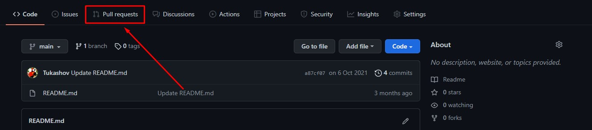
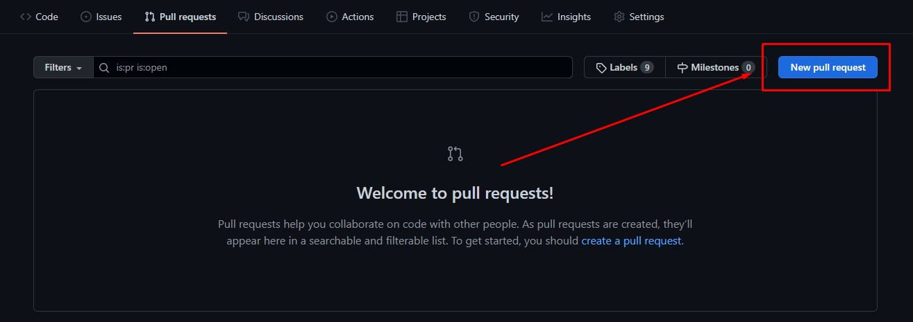
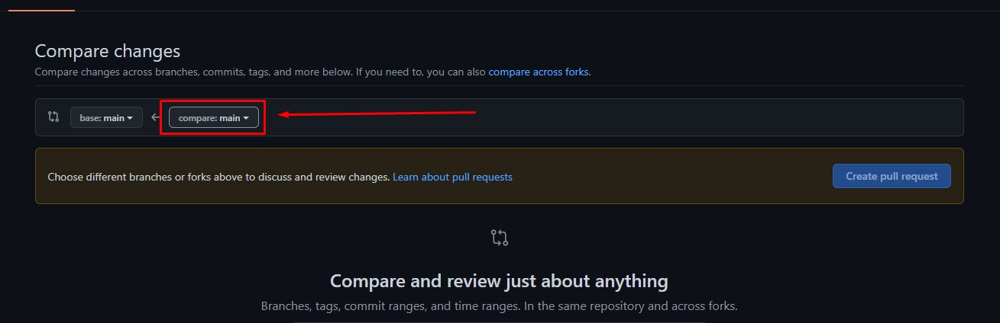
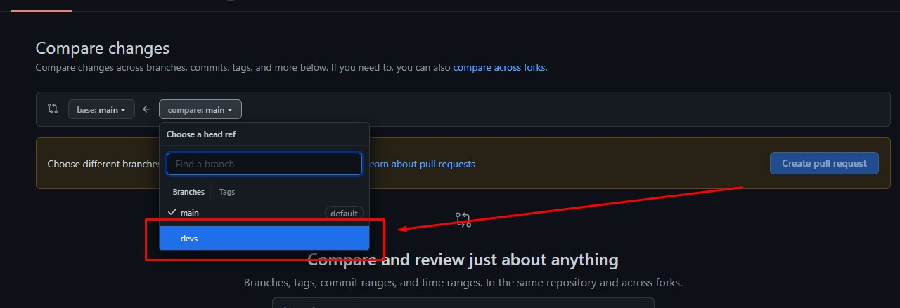
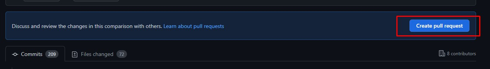
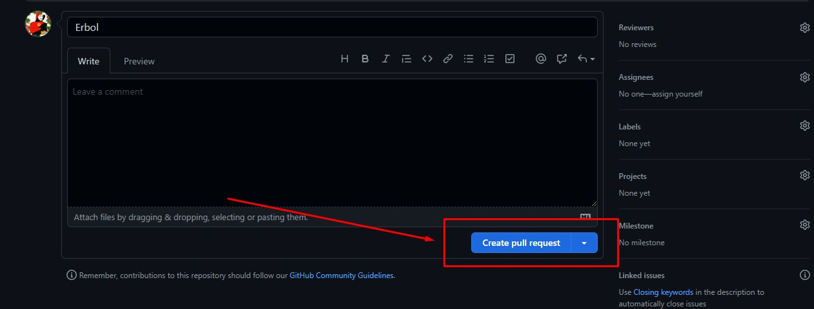
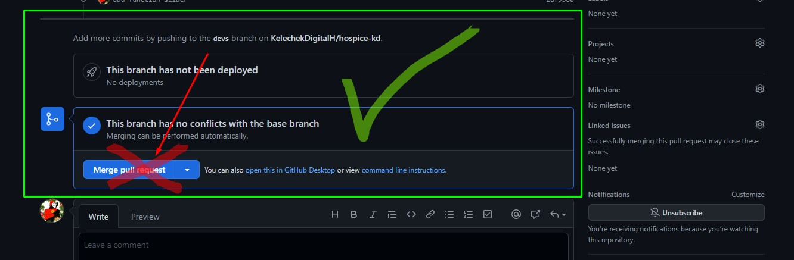

# [hospice-kd](https://kelechekdigitalh.github.io/hospice-kd/)

1. Git Bash'ты сиз иштей турган папкадан ачасыз.
2. `git clone https://github.com/KelechekDigitalH/hospice-kd.git` ушуну Git Bash'ка жазып Enter'ди базыңыз.
3. `cd hospice-kd` жазыңыз жана Enter'ди базыңыз.
   - бул команданын жардамы менен hospice-kd деген папканын ичине киребиз
4. `code .` жазыңыз жана Enter'ди базыңыз.
   - бул аркылуу папкабызды VSCode'тон ачып алабыз.
5. `git checkout devs` жазыңыз жана Enter'ди базыңыз.
   - Бол команда менен `devs` деген веткага өтөбүз.
7. Эми өзүңүзгө тийешелүү баракчанын үстүндө иштей берсеңиз болот.
8. Жумушуңузду бүткөндөн кийин `git add .` жазыңыз жана Enter'ди базыңыз.
9. `git commit -m "Бул жерге комментарий жазып коюуңуз кыска жана түшүнүктүү болушу керек.`
10. `git push origin devs` жазыңыз жана Enter'ди базыңыз.
11. Эми GitHub ка барып төмөнкү сүрөттөгү баскычты табыңыз (Pull requests) 

12. Андан соң (New pull request)

13. Эми оң жактагы **main** веткасын басыңыз

14. **devs** веткасын базыңыз

15. **Create pull request** базыңыз

16. Дагы **Create pull request** базыңыз

17. Бүттү)) Pull request жоноткон сон Молдогазы мырзага айтып койсонуз э))
**Merge pull request баспаңыз ×**

